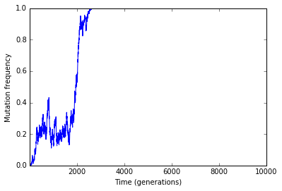
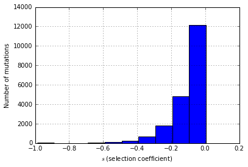

# Tracking mutation frequencies


```python
%matplotlib inline
%pylab inline
import fwdpy as fp
import pandas as pd
import matplotlib
import matplotlib.pyplot as plt
import copy
```

    /usr/local/lib/python2.7/dist-packages/matplotlib/font_manager.py:273: UserWarning: Matplotlib is building the font cache using fc-list. This may take a moment.
      warnings.warn('Matplotlib is building the font cache using fc-list. This may take a moment.')


    Populating the interactive namespace from numpy and matplotlib


## Run a simulation


```python
nregions = [fp.Region(0,1,1),fp.Region(2,3,1)]
sregions = [fp.ExpS(1,2,1,-0.1),fp.ExpS(1,2,0.01,0.001)]
rregions = [fp.Region(0,3,1)]
rng = fp.GSLrng(101)
popsizes = np.array([1000],dtype=np.uint32)
popsizes=np.tile(popsizes,10000)
#Initialize a vector with 1 population of size N = 1,000
pops=fp.SpopVec(1,1000)
#This sampler object will record selected mutation
#frequencies over time.  A sampler gets the length
#of pops as a constructor argument because you 
#need a different sampler object in memory for
#each population.
sampler=fp.FreqSampler(len(pops))
#Record mutation frequencies every generation
#The function evolve_regions sampler takes any
#of fwdpy's temporal samplers and applies them.
#For users familiar with C++, custom samplers will be written,
#and we plan to allow for custom samplers to be written primarily 
#using Cython, but we are still experimenting with how best to do so.
rawTraj=fp.evolve_regions_sampler(rng,pops,sampler,
                                  popsizes[0:],0.001,0.001,0.001,
                                  nregions,sregions,rregions,
                                  #The one means we sample every generation.
                                  1)
```


```python
rawTraj = [i for i in sampler]
#This example has only 1 set of trajectories, so let's make a variable for thet
#single replicate
traj=rawTraj[0]
print traj.head()
print traj.tail()
print traj.freq.max()
```

          esize    freq  generation  origin       pos
    0 -0.314966  0.0005           1       0  1.382760
    1 -0.021193  0.0005           1       0  1.367676
    2 -0.066601  0.0005           1       0  1.125086
    3 -0.066601  0.0005           2       0  1.125086
    4 -0.066601  0.0010           3       0  1.125086
               esize    freq  generation  origin       pos
    104420 -0.016016  0.0005        9999    9998  1.773315
    104421 -0.155373  0.0005        9999    9998  1.912775
    104422 -0.155373  0.0005       10000    9998  1.912775
    104423 -0.042471  0.0005       10000    9999  1.738310
    104424 -0.030944  0.0005       10000    9999  1.805271
    1.0


## Group mutation trajectories by position and effect size

#### Max mutation frequencies


```python
mfreq = traj.groupby(['pos','esize']).max().reset_index()
#Print out info for all mutations that hit a frequency of 1 (e.g., fixed)
mfreq[mfreq['freq']==1]
```


<div>
<table border="1" class="dataframe">
  <thead>
    <tr style="text-align: right;">
      <th></th>
      <th>pos</th>
      <th>esize</th>
      <th>freq</th>
      <th>generation</th>
      <th>origin</th>
    </tr>
  </thead>
  <tbody>
    <tr>
      <th>2701</th>
      <td>1.134096</td>
      <td>0.001812</td>
      <td>1.0</td>
      <td>2612</td>
      <td>43</td>
    </tr>
  </tbody>
</table>
</div>


The only fixation has an 'esize' $> 0$, which means that it was positively selected,

#### Frequency trajectory of fixations 


```python
#Get positions of mutations that hit q = 1
mpos=mfreq[mfreq['freq']==1]['pos']
```


```python
#Frequency trajectories of fixations
fig = plt.figure()
ax = plt.subplot(111)
plt.xlabel("Time (generations)")
plt.ylabel("Mutation frequency")
ax.set_xlim(traj['generation'].min(),traj['generation'].max())
for i in mpos:
    plt.plot(traj[traj['pos']==i]['generation'],traj[traj['pos']==i]['freq'])
```





```python
#Let's get histogram of effect sizes for all mutations that did not fix
fig = plt.figure()
ax = plt.subplot(111)
plt.xlabel(r'$s$ (selection coefficient)')
plt.ylabel("Number of mutations")
mfreq[mfreq['freq']<1.0]['esize'].hist()
```


    <matplotlib.axes._subplots.AxesSubplot at 0x7f396f0f7090>





```python

```
