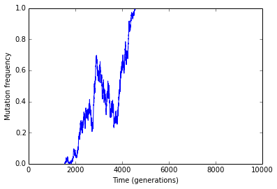
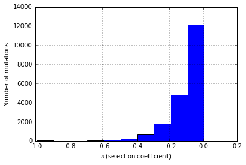

Tracking mutation frequencies
=============================

.. code:: python

    %matplotlib inline
    %pylab inline
    import fwdpy as fp
    import pandas as pd
    import matplotlib
    import matplotlib.pyplot as plt

.. parsed-literal::

    Populating the interactive namespace from numpy and matplotlib

Run a simulation
----------------

This is the same example that you see in :func:`fwdpy.fwdpy.trajectories`, except that I've changed the random number seed.

.. code:: python

    nregions = [fp.Region(0,1,1),fp.Region(2,3,1)]
    sregions = [fp.ExpS(1,2,1,-0.1),fp.ExpS(1,2,0.01,0.001)]
    rregions = [fp.Region(0,3,1)]
    rng = fp.GSLrng(201)
    popsizes = np.array([1000],dtype=np.uint32)
    popsizes=np.tile(popsizes,10000)
    pops = fp.evolve_regions(rng,1,1000,popsizes[0:],0.001,0.001,0.001,nregions,sregions,rregions,track=True)
    traj = [fp.trajectories(i) for i in pops]

Group mutation trajectories by position and effect size
-------------------------------------------------------

Max mutation frequencies
^^^^^^^^^^^^^^^^^^^^^^^^

.. code:: python

    mfreq = traj[0].groupby(['pos','esize']).max().reset_index()
    #Print out info for all mutations that hit a frequency of 1 (e.g., fixed)
    mfreq[mfreq['freq']==1]

.. raw:: html

    

    <table border="1" class="dataframe">
      <thead>
        <tr style="text-align: right;">
          <th></th>
          <th>pos</th>
          <th>esize</th>
          <th>freq</th>
          <th>generation</th>
        </tr>
      </thead>
      <tbody>
        <tr>
          <th>16467</th>
          <td> 1.817526</td>
          <td> 0.001171</td>
          <td> 1</td>
          <td> 4587</td>
        </tr>
      </tbody>
    </table>
    
1 rows × 4 columns

    

The only fixation has an 'esize' :math:`> 0`, which means that it was
positively selected,

Frequency trajectory of fixations
^^^^^^^^^^^^^^^^^^^^^^^^^^^^^^^^^

.. code:: python

    #Get positions of mutations that hit q = 1
    mpos=mfreq[mfreq['freq']==1]['pos']

.. code:: python

    #Frequency trajectories of fixations
    fig = plt.figure()
    ax = plt.subplot(111)
    plt.xlabel("Time (generations)")
    plt.ylabel("Mutation frequency")
    ax.set_xlim(traj[0]['generation'].min(),traj[0]['generation'].max())
    for i in mpos:
        plt.plot(traj[0][traj[0]['pos']==i]['generation'],traj[0][traj[0]['pos']==i]['freq'])

.. code:: python

    #Let's get histogram of effect sizes for all mutations that did not fix
    fig = plt.figure()
    ax = plt.subplot(111)
    plt.xlabel(r'$s$ (selection coefficient)')
    plt.ylabel("Number of mutations")
    mfreq[mfreq['freq']<1.0]['esize'].hist()

.. parsed-literal::

    <matplotlib.axes.AxesSubplot at 0x7fa486531ed0>

Reducing the memory footprint
-----------------------------

In cases of long simulations and/or large mutation rates and/or large
population sizes, it can take a lot of RAM to track mutation
frequencies.

However, you do not have to keep all frequencies in memory!

Let's do something better, and store them every 1,000 generations to an
h5 file.

.. code:: python

    #Let's redo the simulation above, but with different variables, etc.
    rng2= fp.GSLrng(201)
    popsizes = np.array([1000],dtype=np.uint32)
    ##Now, popsizes will be 10x smaller...
    popsizes=np.tile(popsizes,1000)
    #Evolve the first 'N' generations:
    pops2 = fp.evolve_regions(rng2,1,1000,popsizes[0:],0.001,0.001,0.001,nregions,sregions,rregions,track=True)
    #get the trajectories:
    traj2 = [fp.trajectories(i) for i in pops2]
    
    #open an hdf 5 file:
    hdf = pd.HDFStore("trajectories.h5",'w')
    hdf.open()
    #Write the first set of trajectories
    hdf.append('traj',traj2[0])
    
    #clear out trajectories in every population
    for i in pops2:
        i.clearTraj()

.. code:: python

    #Evolve for another 9N generations
    #Update the h5 file after each chunk, and then clear out trajectories
    for i in range(9):
        fp.evolve_regions_more(rng2,pops2,popsizes[0:],0.001,0.001,0.001,nregions,sregions,rregions,track=True)
        traj2 = [fp.trajectories(i) for i in pops2]
        hdf.append('traj',traj2[0])
        for j in pops2:
            j.clearTraj()
    ##Close the h5 file
    hdf.close()

.. code:: python

    ##Get the data frame out
    traj2 = pd.read_hdf('trajectories.h5','traj')

.. code:: python

    len(traj[0])==len(traj2)

.. parsed-literal::

    False

Why are the two objects not the same length?  We did the same thing, right, but in chunks the second time?  Well, not quite.

Each time we call :func:`fwdpy.fwdpy.evolve_regions` and/or :func:`fwdpy.fwdpy.evolve_regions_more`, we are using the existing random number generator (RNG) to randomly seed RNGs for each thread.  Thus, the total number of calls to the global RNG (the variable called *rng2* in our code) differs from the number of calls to the *rng* variable above.

.. code:: python

    mfreq2 = traj2.groupby(['pos','esize']).max().reset_index()
    #Print out info for all mutations that hit a frequency of 1 (e.g., fixed)
    mfreq2[mfreq2['freq']==1]

.. raw:: html

    

    <table border="1" class="dataframe">
      <tbody>
        <tr>
          <td>Int64Index([], dtype='int64')</td>
          <td>Empty DataFrame</td>
        </tr>
      </tbody>
    </table>
    
0 rows × 4 columns

    

See, no fixations this time!

Conclusion
~~~~~~~~~~

You can run the simulation in chunks to save RAM, but you won't get the
same result because this method uses the RNG differently.
